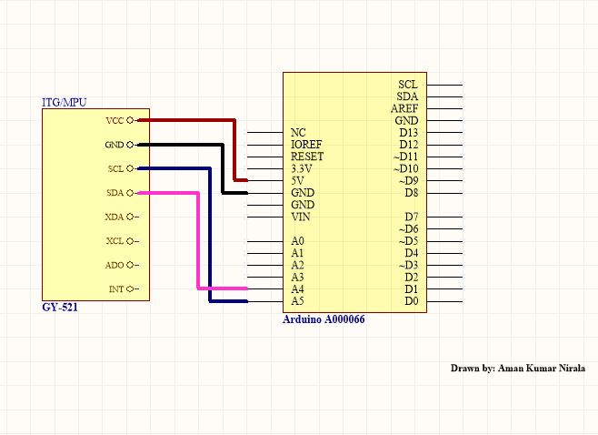

# Arduino-NodeJS-360-Video-Player
In this project, I created a 360 video player (currently playing a demo mp4 file) and a controller with Arduino UNO.

# Requirements:
- Arduino UNO
- ITG/MPU GY-521 Sensor module
- USB-cable for serial connection between the development board and the computer
- Arduino IDE and any other IDE for Arduino
- NodeJS (v12.14.1 tested)
- Typescript (v4.2.3 tested)
- Localhost server for client
- *A cup of coffee and a nice Spotify playlist*

# Build Arduino controller
For making the arduino controller you need the Arduino development board and a ITG/MPU 3-axis Acc. and Gyro. sensor board (I am using GY-521 here). Follow the circuit diagram below to build your circuit.



Once the cicruit is build, we need to pregram the micro-controller. [Download the script](https://github.com/amannirala13/Arduino-NodeJS-360-Video-Player/blob/main/arduino-script/AccGyrotemp/AccGyroTemp.ino) and open it in ArduinoIDE or any IDE of your choice and flash it to the arduino.

Now you can open up a serial console and check if your arduino is giving you the desired output or not. The output should look something like this:
```
91,46,-154
109,57,-152
98,21,-156
104,35,-171
96,51,-149
124,52,-142
118,66,-155
```

After we have done this we need to change the code of our **index.ts** in the **/server/script** folder.

Open the file and look for the variable **portname** and change it to the port to which your arduino is connect. For me it would be:

```ts
// Defining the port name: This is the port to which your arduino is connected.
// Change it to the name of the port to which you have connected your arduino
const portName = 'COM10';
```

Now we are done with the controller part. Lets to some Typescripting now and build our server and client.

# Build Server and Client script
To build the server-side code, follow these steps:
- Download the repository and head to the **server** folder.
- In the terminal type the following command to **install node modules**:
  
  ```sh
  npm install
  ```
- Open the same **index.ts** file in **/server/script** folder and look for the variable called **socketPortNumber**
- Change the value of the variable to socket number you want to start listening for a connection. For me it would be:
  ```ts
  // Defining port number: (Change this port number to the port you want to make a socket connection though)
  const socketPortNumber = 3000;
  ```
- Optionally you can also change the prepix for the socket connection from **"/arduino"** to anything you like. For me it is:
  ```ts
  // Assigning a prefix. When a client tries to connect to the host with this prefix, a socket connection is established
  // between the client and the listening server
  socketServer.installHandlers(server, { prefix: '/arduino' });
  ```
 
- Once the modules are installed and port numbers are assigned we are ready to build and start our servers.
- To **build** the TS files into JS, run the following command

  ```sh
  npm run-script build
  ```

- To **start the server**, run the following command:

  ```sh
  npm run-script start
  ```
 
>> ***Note:*** The start command automatically builds the TS files as well, so you cant skip the build step and directly run the start command.

---

For building the client, run the following command in the **www** folder:

```sh
tsc
```
Go though the generate JS files and remove the lines that are surrounded by the *remove comment block*

Finally,

- Start your localhost with the index.html, the NodeJS server and arduino programmed and connected to the serial port.
- Wait for the socket connection to establish.
- Once that is done, you are ready to go.
